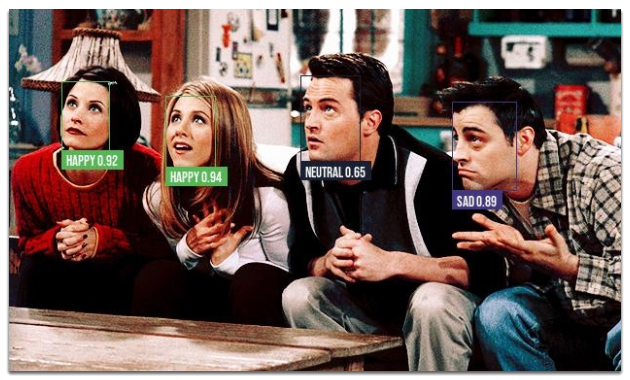
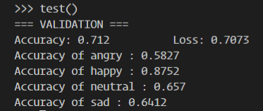
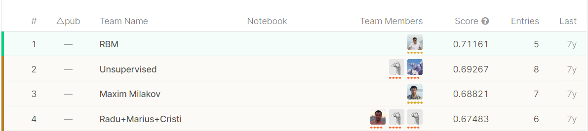

<h1>Facial Expression Detector 🙌</h1>

Facial Expression Detection with PyTorch 🔥

  

<h3> Overview 🎯 </h3>
<h4>🔢Results</h4>

Model Metrics

Top Models on Kaggle

 
  

From the screenshots, our model would have placed 1st in the Kaggle competition! However, there are many components in play here.

1. The model is trained on only 4 categories instead of 7. The decision to go with fewer categories is due to the unbalance data in each categories plus model performs better on fewer categories 😊
2. I split the train.csv into train and validation set which gives me only 4210 of datapoints to validate against while Kaggle competition was tested on 7179 datapoints. Reason why I can't use the Kaggle test.csv is because it is unlabeled and the competition closed so I cannot enter.

### Technologies 🔨

- **🔥 PyTorch**: Deep Learning Framework
- **⚡ Transfer Learning**: Trained on a pre-trained model
- **📹 OpenCV**: Computer Vision library to process video data
- **💧 [FER Dataset](https://www.kaggle.com/c/challenges-in-representation-learning-facial-expression-recognition-challenge)**: Face images taken from FER dataset from Kaggle

### Developed by [Khem Sok](https://github.com/khemsok) 🧐

Thanks For Reading!
  

  

